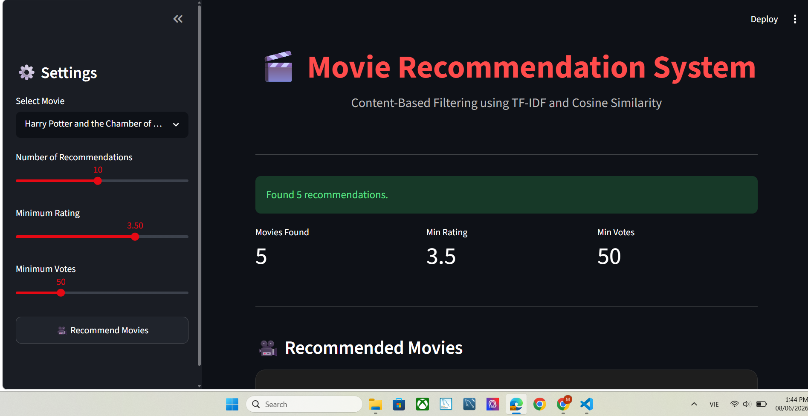
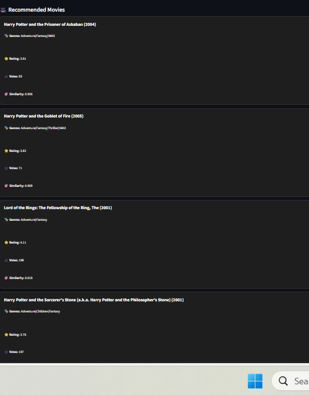

# 🎬 Movie Recommendation System
## Overview
This project is a Content-Based Movie Recommendation System built using the MovieLens dataset.
The system recommends movies similar to a selected movie using:
- TF- IDF Vectoriation
- Cosine Similarity 
- Streamlit Web Application
  
## Dataset
MovieLens Dataset
Files used:
- movies.csv
- ratings.csv
- tags.csv

## Project Workflow
1. Data Ingestion
2. Data Cleaning
3. Feature Engineering
4. TF-IDF Vectorization
5. Cosine Similarity Calculation
6. Recommendation Engine
7. Streamlit Deployment

## Technologies
- Python
- Pandas
- Numpy
- Scikit-learn
- Streamlit

## How to Run
pip install -r requirements.txt
streamlit run app.py

## Result
The system recommends movies based on content similarity between genres and tags

## Future Improvements
- Movie Poster Integration
- TMDb API
- Hybrid Recommendation System
- User-Based Collaborative Filtering
  
## Application Preview

